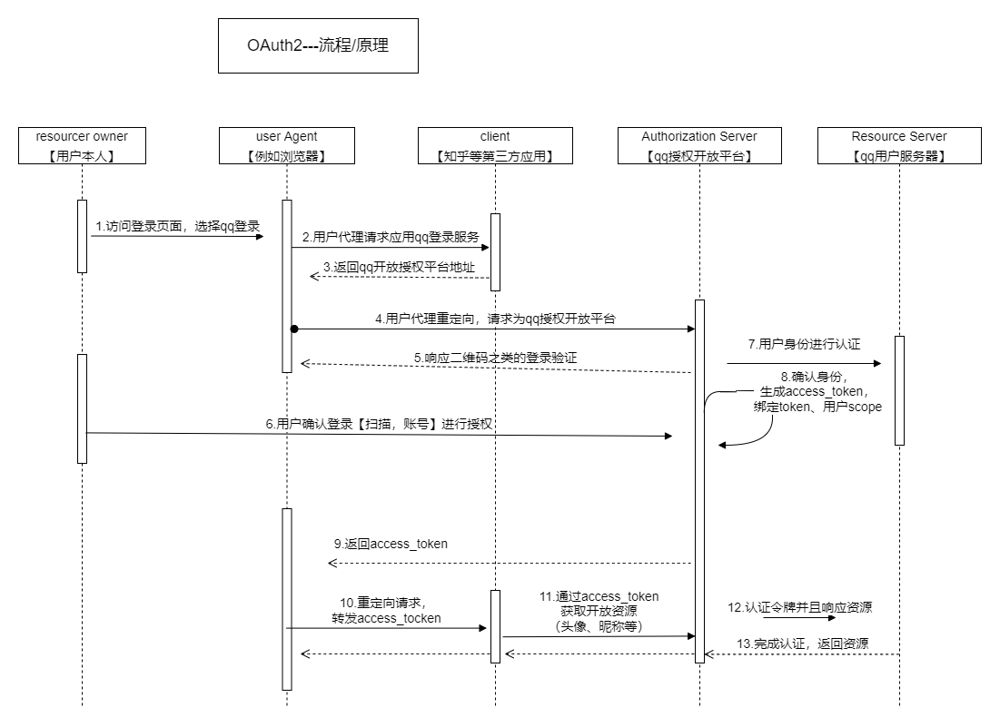

 认证 & 登录
==

## 环境配置

+ 创建auth-server模板管理认证功能


+ host代理域名auth.gulimall.com

+ 引入common模块

+ 放入nacos配置中心和注册中心中

+ 引入登录页面和注册页面【index.html，host修改，放静态资源到nginx中】

+ 网关配置

  ```yaml
  spring:
    cloud:
      gateway:
        routes:
  ## 认证中心服务，auth-server模块
          - id: auth-server
            uri: lb://gulimall-auth-server
              predicates:
                - Host=auth.gulimall.com
  ```

+ nginx配置
  nginx.conf

  ```she
  # 配置上游服务器
      upstream gulimall{
          server 192.168.31.107:88;
      }
  
      include /etc/nginx/conf.d/*.conf;
  }
  ```

  gulimall.conf

  ```shell
   location / {
          # 修改为gulimall请求的index.html页面【找到上游服务器，即getway】
          proxy_pass http://gulimall;
          # 设置host请求头的值
          proxy_set_header Host $host;
      }
  ```

  

## 业务功能

### 验证码功能

#### 倒计时器

**<font color=green>页面:</font>**

+ 建立发送按钮/标签

```html
<a id="sendCode"> 发送验证码 </a>
```

+ jquery语法

```js
//发送验证码
			$(function (){
				$("#sendCode").click(function (){
					//1.给指定手机发送验证码
					//2.启动倒计时功能
					if($(this).hasClass("disabled")){
                        //如果class属性是disable，不给予操作【防止多次点击导致读秒加快】
					}else{
						timeoutChangeStyle();
					}
				});
			});
//倒计时功能
var num=60;
function timeoutChangeStyle(){
   //jquery方法attr,设置标签class
   $("#sendCode").attr("class","disabled");   //倒计时期间无法再次点击【防止多次点击导致线程多了，读秒变快】
   if(num == 0){
      $("#sendCode").text("发送验证码");
      num = 60;
      $("#sendCode").attr("class","");
   }else{
      var str= num + "s 后再次发送";
      $("#sendCode").text(str);
      setTimeout("timeoutChangeStyle()",1000);
   }
   num --;
}
```

#### 发送/接受验证码

使用阿里云官网提供的短信服务接口

>  <font color=red>:exclamation:注意事项：</font>
>
> + 视频中的阿里云短信服务文档和实际中有时间出入，具体参考官方文档
> + 短信发送不能由前端发送，容易遭到截取，例如F12控制台查看。应该由后台发送验证码请求。 
>   +  [阿里云市场-短信验证码服务](https://market.aliyun.com/products/57124001/cmapi00037170.html?spm=5176.2020520132.101.4.435d7218BTWg9W#sku=yuncode31170000018)

+ 编写第三方服务

【所有的第三方服务提供统一由gulimall-third-party模块提供】

① 创建新类：SmsComponent.java

```java
/**
 * 认证&登录-验证码发送功能
 */

@ConfigurationProperties(prefix = "spring.cloud.alicloud.sms")    //与配置文件绑定
@Data
@Component
public class SmsComponent {

    private String host;
    private String path;
    private String method;
    private String appcode;
    private String templateId;

    public void sendSmsCode(String phoneNumber,String content){
        Map<String, String> headers = new HashMap<String, String>();
        //最后在header中的格式(中间是英文空格)为Authorization:APPCODE 83359fd73fe94948385f570e3c139105
        headers.put("Authorization", "APPCODE " + appcode);
        //根据API的要求，定义相对应的Content-Type
        //备注：所谓content-type即是postman的body的选项标签
        headers.put("Content-Type", "application/x-www-form-urlencoded; charset=UTF-8");
        Map<String, String> querys = new HashMap<String, String>();
        Map<String, String> bodys = new HashMap<String, String>();
        bodys.put("content", content);
        bodys.put("template_id", templateId);
        bodys.put("phone_number", phoneNumber);


        try {
            /**
             * 重要提示如下:
             * HttpUtils请从
             * https://github.com/aliyun/api-gateway-demo-sign-java/blob/master/src/main/java/com/aliyun/api/gateway/demo/util/HttpUtils.java
             * 下载
             *
             * 相应的依赖请参照
             * https://github.com/aliyun/api-gateway-demo-sign-java/blob/master/pom.xml
             */
            HttpResponse response = HttpUtils.doPost(host, path, method, headers, querys, bodys);
            System.out.println(response.toString());
            //获取response的body
            //System.out.println(EntityUtils.toString(response.getEntity()));
        } catch (Exception e) {
            e.printStackTrace();
        }
    }
}
```

> 需要引入HttpUtils类。直接在config包下新建并且拷贝[HttpUtils.java](https://github.com/aliyun/api-gateway-demo-sign-java/blob/master/src/main/java/com/aliyun/api/gateway/demo/util/HttpUtils.java)内容

配置文件关联上述private属性

```yaml
spring.cloud.sms:
  host: https://dfsns.market.alicloudapi.com
  path: /data/send_sms
  method: POST
  appcode: f8cedaeaaaf2455ebd275ddc248ad277
  templateId: CST_ptdie100
```

② 创建Controller接受

```java
@RestController
@RequestMapping("/sms")
public class SmsSendController {

    @Autowired
    private SmsComponent smsComponent;

    /**
     * 备注：
     * 该服务提供是由别的服务调用的，而不是页面直接调用的。所以添加@GetMapping做请求路径处理
     */
    @GetMapping
    public R sendCode(@RequestParam("phone") String phoneNumber, @RequestParam("content") String content){
        smsComponent.sendSmsCode(phoneNumber,content);
        return R.ok();
    }
}
```

+ 认证中心模块做验证码发送功能

  【gulimall-auth-server】

① 创建LoginController.java接受”发送验证码“请求

```java
@ResponseBody
@GetMapping("/sms/sendCode")
public R sendCode(@RequestParam("phone") String phoneNumber){
    //随机验证码
    String substring = UUID.randomUUID().toString().substring(0, 5);
  thirdPartFeignService.sendCode(phoneNumber,"code:"+substring);
    return R.ok();
}
```

② 引入Feign远程调用依赖，并且在主程序中`@EnableFeignClients`启用feign

③ 创建feign，向`gulimall-thirty-part`发送请求服务

```java
@FeignClient("gulimall-third-party")    //通过feign调用第三方服务
public interface ThirdPartFeignService {

    @GetMapping("/sms/sendCode")
    public R sendCode(@RequestParam("phone") String phoneNumber, @RequestParam("content") String content);
}
```

④ 配置页面发送的请求参数，基本的请求格式：`http://http://auth.gulimall.com/sms/sendCode?phone=`

#### 验证码接口防刷

<font color=red>需求描述:</font>

在”注册页面“的”发送验证码“功能中，虽然有倒计时机制，但是重要通过刷新页面，就可以做验证码发送。且通过控制台可以查看到源码中发送的请求地址，这里存在验证码接口被恶意消耗的可能。【验证码频率，恶意刷验证码接口】

<font color=green>解决思路:</font>

① 关于刷新页面，验证码频率问题。可以设置redis校验时间，【redis中key为手机号，同个手机号需要超过指定时间才能再次发送】

```java
//LoginController.java
public R sendCode(@RequestParam("phone") String phoneNumber){
 //TODO 1.接口防刷
 //1.1验证码频率
        String redisKey = redisTemplate.opsForValue().get(AuthServerConstant.SMS_CODE_CACHE_PREFIX + phoneNumber);
        if(!StringUtils.isEmpty(redisKey)){
            long l = Long.parseLong(redisKey.split("_")[1]);
            //系统为毫秒单位
            if(System.currentTimeMillis()-l <60*1000){
                //60秒内不能再发
                return R.error(BizCodeEnume.SMS_CODE_EXCEPTION.getCode(), BizCodeEnume.SMS_CODE_EXCEPTION.getMsg());
            }
        }}
```

补充枚举SMS_CODE_EXCEPTION

```java
//BizCodeEnume
SMS_CODE_EXCEPTION(10002, "验证码获取频率太高，请稍后再发送"),
```

前端回调

```js
//发送验证码
$(function (){
   $("#sendCode").click(function (){
      //2.启动倒计时功能
      if($(this).hasClass("disabled")){
         //正在倒计时中

      }else{
         //1.给指定手机发送验证码
         $.get("/sms/sendCode?phone="+$("#phoneNumber").val(),function (data){
            if(data.code !=0){
               //60s内只允许获取一次验证码
               alert(data.msg);
            }
         })
         timeoutChangeStyle();
      }
   });
});
```

② 接口防刷

//TODO


#### 验证码校验

思路：后台在接收到验证码请求后，在redis中临时存储验证码，后续再与用户的验证码请求进行校验。

① auth模块引入redis依赖，配置redis地址

② LoginController.java处理业务逻辑

```java
 public R sendCode(@RequestParam("phone") String phoneNumber){ 
     //随机验证码
        String substring = "code:"+UUID.randomUUID().toString().substring(0, 5);
     //redis：key-phone,value-code 格式【sms:code:159xxxx123->123】
    //key:前缀+手机号，value:验证码，消亡时间，时间单位
redisTemplate.opsForValue().set(AuthServerConstant.SMS_CODE_CACHE_PREFIX+phoneNumber,substring,10, TimeUnit.MINUTES);
      thirdPartFeignService.sendCode(phoneNumber,substring);
        return R.ok();
 }
```

> SMS_CODE_CACHE_PREFIX是常用值，放在common模块，不设置问题也不大

### 注册功能

+ 创建VO，做校验

  ```java
  @Data
  public class UserRegistVo {
  
      @NotEmpty(message = "用户名必须提交")
      @Length(min = 6,max = 18,message = "用户名必须是6-18位")
      private String userName;
      @NotEmpty(message = "密码不能为空")
      @Length(min = 6,max = 18,message = "密码必须是6-18位")
      private String passWord;
      //正则表达式：不能为空^，第一位是1，第二位是3-9，剩下的是0-9且必须有9个
      @Pattern(regexp = "^[1]([3-9])[0-9]{9}$/",message = "手机号格式不正确")
      @NotEmpty(message = "手机号不能为空")
      private String phone;
      @NotEmpty(message = "验证码不能为空")
      private String code;
  }
  ```

+ 处理校验
  内置对象：BindingResult搭配@Valid做校验；RedirectAttributes处理重定向无法接收post请求

```java
//LoginController.java   
/** 重定向携带数据。利用session原理。将数据放在session中。只要跳到下一个页面取出这个数据以后，session里面的数据就会删掉
**/
    // TODO【分布式情况下，session会存在问题】
    @PostMapping("/register")
    public String register(@Valid UserRegistVo userRegistVo, BindingResult result, RedirectAttributes redirectAttributes){
//BindingResult:持有验证运行的结果，也就是配合着@Valid注解校验bean的结果
        if(result.hasErrors()){
            Map<String, String> errors = result.getFieldErrors().stream().collect(Collectors.toMap(FieldError::getField, FieldError::getDefaultMessage));
//            model.addAttribute("errors",errors);
            redirectAttributes.addFlashAttribute("errors",errors);
             //return "register";      //转发模式，会自行拼串前后缀,由thymeleaf重新渲染 【会产生的问题：刷新页面导致模板重复提交】
            //重定向模式转发，【前端发送的服务是post，而register.html页面是转发后接收的页面，这里默认只是支持get【重定向不会携带数据，即post】，会产生的问题是： Request method 'POST' not supported】
            return "redirect:http://auth.gulimall.com/register.html";
        }

        //注册成功回登录页
            //由于config包映射了login.html的地址，所以这里返回不需要用全路径：http://auth.gulimall.com/login.html
        return "redirect:/login.html";
    }
```

+ 页面渲染

  ```html
  <div class="tips" style="color: red" th:text="${errors!=null?(#maps.containsKey(errors,'userName')?errors.userName:''):''}">
  ```

+ 证码注册

  （前面已经完成了验证码发送、接收、后台redis处理校验逻辑）

  ---- 注册功能由gulimall-member完成，需要进行远程调用

  ① 调用远程服务gulimall-member

  ```java
  @FeignClient("gulimall-member")
  public interface MemberFeignService {
  
      @PostMapping("member/member/register")
       R register(@RequestBody UserRegistVo userRegistVo);
  }
  ```

  ② gulimall-member做注册功能接口

  ```java
  /**
   * 会员注册功能
   */
  @PostMapping("/register")
  public R register(@RequestBody MemberRegisterVo memberRegisterVo){
  
      try {
          memberService.register(memberRegisterVo);
      }catch (PhoneExistException e){
          return R.error(BizCodeEnume.PHONE_EXIST_EXCEPTION.getCode(),BizCodeEnume.PHONE_EXIST_EXCEPTION.getMsg());
      }catch (UserNameExistException e){
          return R.error(BizCodeEnume.USER_EXIST_EXCEPTION.getCode(),BizCodeEnume.USER_EXIST_EXCEPTION.getMsg());
      }
  
      return R.ok();
  }
  ```

```java
 @Override
    public void register(MemberRegisterVo memberRegisterVo) {

        MemberEntity memberEntity = new MemberEntity();
        MemberDao memberDao = this.baseMapper;

        //设置默认等级
        MemberLevelEntity memberLevelEntity = memberLevelDao.getDefaultLevel();
        memberEntity.setLevelId(memberLevelEntity.getId());
        //检查用户名和手机号是否唯一。目的让controller能感知异常，异常机制
        checkPhoneUnique(memberRegisterVo.getPhone());
        checkUserNameUnique(memberRegisterVo.getUserName());

        //设置手机号
        memberEntity.setMobile(memberRegisterVo.getPhone());
        //设置用户名
        memberEntity.setUsername(memberRegisterVo.getUserName());
        //设置密码 【数据库存储密码要进行加密处理】
        BCryptPasswordEncoder passwordEncoder = new BCryptPasswordEncoder();
        memberEntity.setPassword(passwordEncoder.encode(memberRegisterVo.getPassWord()));
        //其他的默认信息

        memberDao.insert(memberEntity);
    }

    @Override
    public void checkPhoneUnique(String phone) throws PhoneExistException{
        MemberDao memberDao = this.baseMapper;
        Long mobile = memberDao.selectCount(new QueryWrapper<MemberEntity>().eq("mobile", phone));
        if(mobile>0){
            throw new PhoneExistException();
        }
    }

    @Override
    public void checkUserNameUnique(String userName) throws UserNameExistException{
        MemberDao memberDao = this.baseMapper;
        Long count = memberDao.selectCount(new QueryWrapper<MemberEntity>().eq("username", userName));
        if(count>0){
           throw new UserNameExistException();
        }
    }
}
```

```xml
    <select id="getDefaultLevel" resultType="com.atguigu.gulimall.member.entity.MemberLevelEntity">
        SELECT * FROM `ums_member_level` WHERE default_status = 1;
    </select>
```


③ 远程调用成功，gulimall-auth-server.loginController进行注册功能

```java
 //调用gulimall-member模块，注册进数据库
                R register = memberFeignService.register(userRegistVo);
                if(register.getCode()==0){
                    //成功注册
                    return "redirect:http://auth.gulimall.com/login.html";
                }else {
                    Map<String, String> errors = new HashMap<>();
                    errors.put("msg",register.getData(new TypeReference<String>(){}));
                    return "redirect:http://auth.gulimall.com/register.html";
                }
```


#### 注册密码存储

<font color=orange>描述:</font>

数据库对于密码存储不能进行明文存储。要进行加密操作，加密模式分为：
可逆【通过算法可知明文】与不可逆【知道算法也推不出】

<font color=green>MD5加密算法</font>

>  说明：
>
> + MD5 (Message Digest algorithm 5 ，信息摘要算法)
>
>   + 压缩性：任意长度的数据，算出的MD5值长度都是固定的
>
>   + 容易计算：从原数据计算出MD5值很容易
>
>   + 抗修改性：对原数据进行任何改动，哪怕只修改1个字节，所得到的MD5值都有很大区别
>
>   + 强抗碰撞：两个不同的数据得到相同MD5值的可能性很低
>
> + 加盐：
>   + 通过生成随机数与MD5生成字符串进行组合
>   + 数据库同时存储MD5值与salt值。验证正确性时使用salt进行MD5即可
>
> 

java的md5对象：

```java
//md5加密
DigestUtils
//md5盐值加密【逻辑类似于：“密码”+system.currentTimeMills()】
    //加盐：$1$+8位字符
Md5Crypt.md5Crypt(Bytes)
```

验证：

用户明文——>md5加密——>+数据库中查询盐值字段<——>校验

spring提供的密码加密器：

```java
//加密
BCryptPasswordEncoder.encode(rawPassWord);
//校验
BCryptPasswordEncoder.matches(rawPassWord，encodePassWord);
```


#### 补充说明

+ 重定向POST请求不被支持

```text
 Request method 'POST' not supported
```

操作：用户注册请求 ——>/regist [post方式] （路径默认都是get方式访问）

<font color=green>解决思路</font>

① 返回值给指定路径，而不是重定向。即直接通过thymeleaf直接渲染【但产生的问题是：刷新页面导致模板重复提交】
② 使用RedirectAttributes是springmvc提供的内置方法，作用：重定向视图，并且携带数据

+ 异常处理机制

<font color=orange>场景描述:</font>

方法register中，含有处理username校验的业务

方法register定义为了void类型，没有返回值。但是，在后续的业务处理中，发现需要反馈给前端错误信息。这时候，可选择异常处理机制进行替代，而不是修改方法类型。

**操作步骤：**
① 创建Exception类，作为反馈异常的信息。实现java内置对象RuntimeException作为运行时异常抛出

```java
public class UserNameExistException extends RuntimeException{

    public UserNameExistException(){
        super("用户名存在异常");
    }
}
```

② 自定义校验方法，如果产生异常则抛出以上信息

```java
@Override
    public void checkUserNameUnique(String userName) throws UserNameExistException{
        MemberDao memberDao = this.baseMapper;
        Long count = memberDao.selectCount(new QueryWrapper<MemberEntity>().eq("username", userName));
        if(count>0){
            throw new PhoneExistException();
        }
        throw new UserNameExistException();
    }
```

③ 层层往上抛，最终由controller接收并反馈给前端

```java
@PostMapping("/register")
public R register(MemberRegisterVo memberRegisterVo){

    try {
        memberService.register(memberRegisterVo);
    }catch (PhoneExistException e){
        return R.error(BizCodeEnume.PHONE_EXIST_EXCEPTION.getCode(),BizCodeEnume.PHONE_EXIST_EXCEPTION.getMsg());
    }catch (UserNameExistException){
        return R.error(BizCodeEnume.USER_EXIST_EXCEPTION.getCode(),BizCodeEnume.USER_EXIST_EXCEPTION.getMsg());
    }

    return R.ok();
}
```

补充异常信息：

common.exception.BizCodeEnume.java

```java
USER_EXIST_EXCEPTION(15001, "用户存在异常"),
PHONE_EXIST_EXCEPTION(15002, "手机号存在异常");
```

### 登录功能

#### 常规登录功能

+ 创建VO

```java
@Data
public class UserLoginVo {
    private String loginAcct;
    private String passWord;
}
```

+ 修改页面渲染

```html
<form action="/login" method="post">
    <div style="color: red" th:text="${errors!=null?(#maps.containsKey(errors,'msg')?errors.msg:''):''}"></div>
   <ul>
      <li class="top_1">
         
         <input type="text"  name="loginAcct" placeholder=" 邮箱/用户名/已验证手机" class="user" />
      </li>
      <li>
         
         <input type="password" name="passWord" placeholder=" 密码" class="password" />
      </li>
      <li class="bri">
         <a href="/static/login/index.html">忘记密码</a>
      </li>
      <li class="ent"><button class="btn2" type="submit"><a>登 &nbsp; &nbsp;录</a></button></li>
   </ul>
</form>
```

+ LoginController.java做请求接收与页面重定向

  ```java
  @PostMapping("/login")
  public String login(UserLoginVo vo,RedirectAttributes redirectAttributes){
      //远程登录
      R login = memberFeignService.login(vo);
      if(login.getCode() == 0){
          return "redirect:http://gulimall.com";
      }else {
          HashMap<String, String> errors = new HashMap<>();
          errors.put("msg",login.getData("msg",new TypeReference<String>(){}));
          redirectAttributes.addFlashAttribute("errors",errors);
          return "redirect:http://auth.gulimall.com/login.html";
      }
  }
  ```

+ Feign做远程调用

+ 远程登录功能

  ```java
  //MemberController.java 
  /**
   * 登录功能
   */
  @PostMapping("/login")
  public R login(@RequestBody MemBerLoginVo memBerLoginVo){
  
      MemberEntity entity = memberService.login(memBerLoginVo);
      if(entity!=null){
          return R.ok();
      }else {
       return R.error(BizCodeEnume.LOGINACCT_PASSWORD_INVAILD_EXCEPTION.getCode(), BizCodeEnume.LOGINACCT_PASSWORD_INVAILD_EXCEPTION.getMsg());
      }
  }
  ```

  ```java
  // MemberServiceImpl.java
  @Override
  public MemberEntity login(MemBerLoginVo memBerLoginVo) {
      //账号匹配【用户名&手机号】
      MemberDao memberDao = this.baseMapper;
      MemberEntity entity = memberDao.selectOne(new QueryWrapper<MemberEntity>().eq("username", memBerLoginVo.getLoginAcct()).
              or().eq("mobile", memBerLoginVo.getLoginAcct()));
      if(entity == null){
          // 登录失败
          return null;
      }else{
          //1.去数据库查询密码”加盐值“【密码存储方式：md5+盐值】,获取数据库的password
          BCryptPasswordEncoder passwordEncoder = new BCryptPasswordEncoder();
          //2.密码匹配
          boolean matches = passwordEncoder.matches(memBerLoginVo.getPassWord(), entity.getPassword());
          if(matches){
              return entity;
          }else {
              return null;
          }}}
  ```

#### 社交登录功能

> 备注：视频使用微博作为权限认证功能。目前没有微博，暂时使用gitee

[gitee_oauth2接口文档](https://gitee.com/api/v5/oauth_doc#/)

+ 业务代码

① 引入http工具类

> + HttpUtils请从
>
> https://github.com/aliyun/api-gateway-demo-sign-java/blob/master/src/main/java/com/aliyun/api/gateway/demo/util/HttpUtils.java下载
> 
>
>    * 相应的依赖请参照
>
>         https://github.com/aliyun/api-gateway-demo-sign-java/blob/master/pom.xml

② 创建OAuth2Controller做请求处理

③ 创建ums_member_social_gitee表接收gitee社交登录的用户信息

```sql
create table ums_member_social_gitee
(
	 gitee_id			bigint not null auto_increment comment 'gitee表id',
   social_uid              varchar(255) comment '社交登录用户的唯一id',
   access_token            varchar(255) comment '令牌',
   expires_in          varchar(255) comment '过期时间',
   token_type			varchar(255) comment 'tocken类型',
   refresh_token           bigint comment '刷新令牌',
   primary key (gitee_id)
);
alter table ums_member_social_gitee comment '社交登录_gitee_用户信息';
```


## 知识

### OAuth2

简介：对于用户相关的OpenAPI（例如获取用户信息、动态同步、照片、日志、分享等），为了保护数据的安全和隐私，第三方网站访问用户数据前都需要显式的向用户征求授权。

oauth2认证流程：


