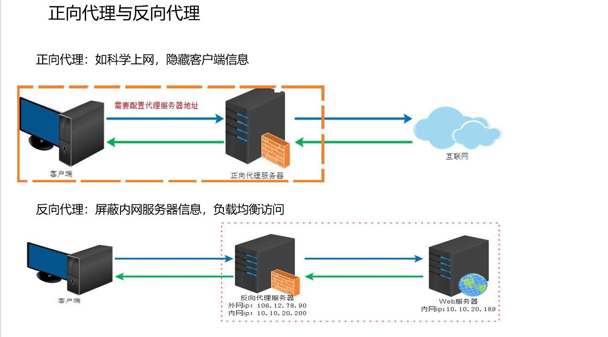
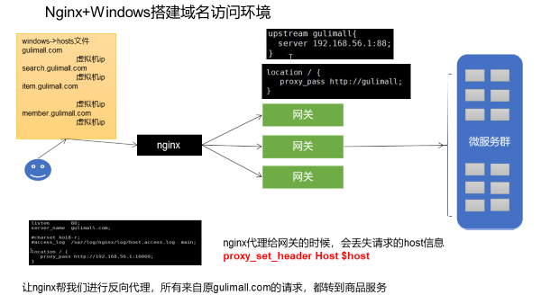

nginx
====

## 代理



## 说明

### nginx配置文件说明

设置域名访问


+ nginx.conf
    + <font color=red>全局块</font> </br>配置影响nginx全局的指令。如：用户组，nginx进程pid存放路径，日志存放路径，配置文件引入，允许生成worker process数等
    + <font color=red>events块</font> </br>
      配置影响nginx服务器或与用户的网络连接。如：每个进程的最大连接数，选取哪种事件驱动模型处理连接请求，是否允许同时接受多个网络连接，开启多个网络连接序列化等。
    + <font color=red>http块</font> </br>
      可以嵌套多个server,配置代理，缓存，日志定义等绝大多数功能和第三方模块的配置。如文件引入，mime-type定义，日志自定义，是否使用sendfile传输文件，连接超时时间，单连接请求数等。
        + <font color=red>http全局块</font> </br> 如upstream,错误页面，连接超时等。
        + <font color=red>server块</font> </br> 配置虚拟主机的相关参数，一个http中可以有多个server。
            + <font color=yellow>location</font> </br> 配置请求路由，以及各种页面的配置
            + <font color=yellow>location</font> </br> ....

+ nginx默认配置路径：</br>
  【docker的nginx挂载路径：/mydata/nginx】 路径：/conf/conf.d/default.conf
+ 创建gulimall.conf </br>
  `cp default.conf gulimall.conf`
+ 修改server块

```linux
server_name  gulimall.com;
 location / {
        # 修改为gulimall请求的index.html页面
        proxy_pass http://gulimall;
        # 设置host请求头的值【nginx转发给网关集群会丢失掉请求头等信息】
        proxy_set_header Host $host;
    }
```

+ 修改http块

```linux
# 配置上游服务器【网关集群】
    upstream gulimall{
        server 192.168.31.107:88;
    }
```

## 需求

1. 域名访问
2. 负载均衡
    + nginx->网关集群->服务集群

### 需求1

#### window模拟域名访问

> 让nginx进行反向代理，类似网关功能。所有gulimall.com的请求，都转到商品服务

+ 修改host文件【记得关闭代理】
    + 路径：C:\Windows\System32\drivers\etc <br>
      \# gulimall【记得关闭代理】 <br>192.168.31.106 &ensp;&ensp; gulimall.com <br>

#### 域名映射效果

+ 无论是请求接口还是请求页面，都是用gulimall.com访问

+ nginx直接代理给网关，网关进行判断
    + 如果是/api/***,转交给对应的服务器
    + 如果是满足域名，转交给对应的服务

### 需求2 nginx动静分离资源

#### 操作

+ 路径：cd `/mydata/nginx/html` 【已挂载nginx在mydata】
+ 创建文件夹 `mkdir static`
+ 把静态资源传输到`static`文件夹中
+ 修改服务`index.html`中的路径
+ 修改nginx配置文件：

```linux
 ## 请求先在static文件夹中查找，然后再将请求转给gulimall.com服务集群
 location /static/ {
        root   /usr/share/nginx/html;
    }

    location / {
        # 修改为gulimall请求的index.html页面
        proxy_pass http://gulimall;
        # 设置host请求头的值
        proxy_set_header Host $host;
    }
```

## 附录

  

