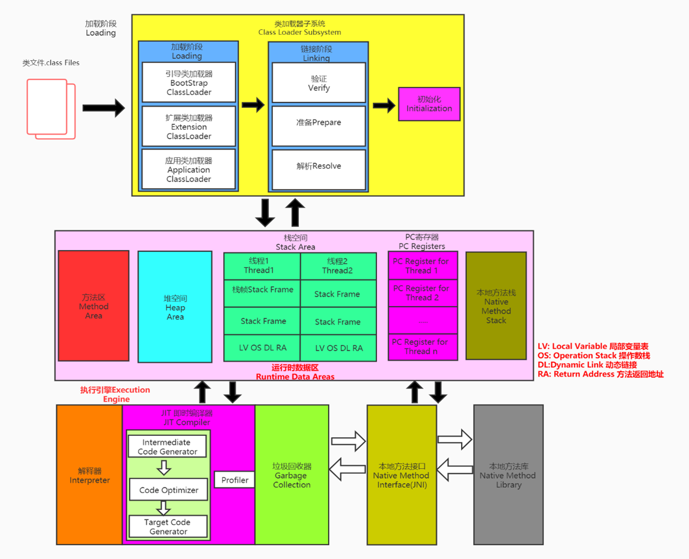

性能与压力测试
====

## 压力测试

压力测试考察当前软硬件环境下系统所能承受的最大负荷并帮助找出系统瓶颈所在。压测都是为了系统在线上的处理能力和稳定性维持在一个标准范围内，做到心中有数。
使用压力测试，我们有希望找到很多种用其他测试方法更难发现的错误。有两种错误类型是: 
内存泄漏，并发与同步 
有效的压力测试系统将应用以下这些关键条件:重复，并发，量级，随机变化

### 影响性能

考虑点：数据库、应用程序、中间件（tomact、Nginx）、网络和操作系统等方面

+ 首先考虑自己的应用属于 CPU 密集型还是 IO 密集型

## 性能指标

+ 响应时间（Response Time:RT） 响应时间指用户从客户端发起一个请求开始，到客户端接收到从服务器返回的响应结束，整个过程所消耗的时间。
+ HPS(Hits Per Second):每秒点击次数，单位是次/秒。
+ TPS（Transaction Per Second）:系统每秒处理交易数，单位是笔/秒。
+ QPS（Query per Second）：系统每秒处理查询次数，单位是次/秒。
    + 对于互联网业务中，如果某些业务有且仅有一个请求连接，那么TPS=QPS=HPS， 一般情况下 
       用 TPS 来衡量整个业务流程，
       用 QPS 来衡量接口查询次数，
       用 HPS 来表 示对服务器单击请求。
+ 最大响应时间（Max Response Time） 指用户发出请求或者指令到系统做出反应（响应） 的最大时间。
+ 最少响应时间（Mininum ResponseTime） 指用户发出请求或者指令到系统做出反应（响 应）的最少时间。
+ 90%响应时间（90% Response Time） 是指所有用户的响应时间进行排序，第90%的响 应时间(即基本满足响应要求)。
+ 从外部看，性能测试主要关注如下三个指标
   吞吐量：每秒钟系统能够处理的请求数、任务数。
   响应时间：服务处理一个请求或一个任务的耗时。
   错误率：一批请求中结果出错的请求所占比例。

> 无论 TPS、QPS、HPS,此指标是衡量系统处理能力非常重要的指标，越大越好，根据经 验，一般情况下： 金融行业：1000TPS~50000TPS，不包括互联网化的活动 保险行业：100TPS~100000TPS，不包括互联网化的活动 制造行业：10TPS~5000TPS 互联网电子商务：10000TPS~1000000TPS 互联网中型网站：1000TPS~50000TPS 互联网小型网站：500TPS~10000TPS

## JMeter

## 性能监控

### jvm内存模型

#### 堆

所有对象实例以及数组都要在堆上分配。堆是垃圾收集器管理的主要区域，也被称为“GC堆”；也是优化最多考虑的地方

+ 新生代
    + eden空间
    + From Survivor 空间
    + To Survivor 空间
+ 老年代
    +

### jvisualvm

Jdk 的两个小工具 jconsole、jvisualvm（升级版的 jconsole）;通过命令行启动，可监控本地和远程应用(也就是监控jvm应用)。
> 如果没有进行java环境配置，则要在指定的jdk的bin中启动终端。

输入指令：`jvisualvm`

 jvisualvm作用：  
监控内存泄露，跟踪垃圾回收，执行时内存、cpu 分析，线程分析...

