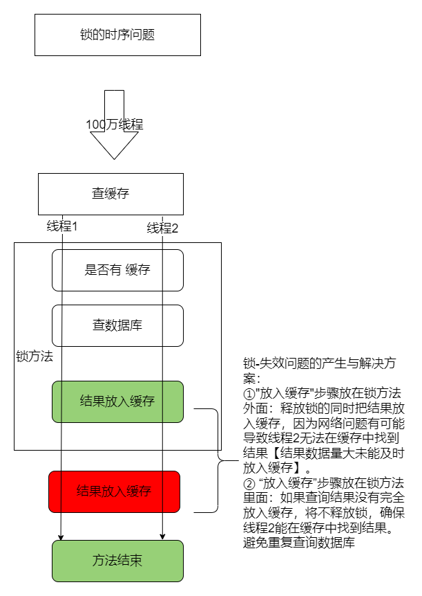

缓存
====

## 1.缓存的使用

为了系统性能的替身，我们一般都会将部分数据放入缓存中，加速访问。而db承担数据落盘工作。

> **哪些数据适合放入缓存：**
> + 即时性、数据一致性要求不高的
> + 访问量大且更新频率不高的数据（读多，写少）

#### 本地缓存

举例：根据categoryServiceImpl.java -- 获取catalogJson的数据

```java
//本地缓存
private Map<String,Object> cache = new HashMap();
public Map<String, List<Catelog2VO>> getCataLogJson() {
        //缓存优化：1.如果缓存中有，就用缓存的
        Map<String, List<Catelog2VO>> catalogJson = (Map<String, List<Catelog2VO>>) cache.get("catalogJson");
        if(cache.get("catalogJson") == null){
            // 没有缓存就在数据库中查找
            .....
        // 查询的又重新放入缓存中
        cache.put("catalogJson",parentCid);
        return xxxx;
        }else{
            return catalogJson;
        }
    }
```

> 这只是适用于本地缓存，但服务器要是分布式就不适用了，需要用redis做中间件

## 2.redis

### springboot整合redis

1. 引入redis 在pom.xml文件中引入

```xml
    <!--引入redis-->
        <dependency>
            <groupId>org.springframework.boot</groupId>
            <artifactId>spring-boot-starter-data-redis</artifactId>
        </dependency>
```

在配置文件中配置redis的ip地址和端口号

```yaml
spring:
   redis:
       host: 192.168.31.106
       port: 6379
```

2. 测试使用redis springboot自动配置中已经配置好了StringRedisTemplate类 redis相当于mapping，存放于key value: key为String,value是object

```java
  // 测试redis
    @Test
    public void testStringRedisTemplate(){
        ValueOperations<String, String> ops = stringRedisTemplate.opsForValue();

        // 保存
        ops.set("hello","word_"+ UUID.randomUUID().toString());
        // 查询
        String hello = ops.get("hello");
        System.out.println("之前保存的数据"+hello);
    }
```

### springboot提供常用的redis类

> 备注：redis的数据都使用json存放
> 好处：跨平台，兼容性强

+ StringRedisTemplate

### 击穿、穿透、雪崩

+ 高并发下缓存失效问题--缓存击穿
    + 缓存击穿</br>
        + 对于一些设置了过期时间的key,如果这些key可能会在某些时间点被超高并发地访问，是一种非常<font color=red>“热点”数据</font>。
        + 如果这个key在大量请求同时进来前正好失效(清理)，那么所有对这个key的数据查询都落到db，称为缓存击穿。
        + 解决：</br>
          加锁。大量并发只让一个去查，其他等待，查到以后释放锁，其他人获取到锁，先查缓存，就会有数据，不用去db。

+ 高并发下缓存失效问题--缓存穿透
    + 缓存穿透：</br>
      指查询一个一定不存在的数据，由于缓存是不命中，将去查询数据库，但是数据库也无此记录，没有将这次查询的null写入缓存，这将导致这个不存在的数据每次请求都要到存储层去查询，失去了缓存的意义。
        + 风险：</br>
          利用不存在的数据进行攻击，数据库瞬间压力增大，最终导致崩溃
        + 解决：</br>
          null结果缓存，并加入短暂过期时间【防止结果存在但仍然判断为空】

+ 高并发下缓存失效问题--缓存雪崩
    + 缓存雪崩：</br>
      指在设置缓存时key采用了相同的过期时间，导致缓存某一时刻同时失效，请求全部转发到DB，DB瞬时压力过重雪崩
        + 解决：</br>
          原有的失效时间基础上增加一个随机值，比如1-5分钟随机，这样每一个缓存的过期时间的重复率就会降低，就很难引发集体失效的事件。

#### 加锁解决缓存击穿

思路：</br>

+ 单服务：

① 在synchronized关键字进行加锁。springboot所有组件在容器中都是单例的，即是百万请求，也需要同时竞争锁。 ② 在获得synchronized后，先进行缓存查询，再进行db查询【有可能上一个查询获得了结果放入缓存了】

```java
synchronized (this){
    //获得锁，先查询缓存再查询db
        String catalogJson=stringRedisTemplate.opsForValue().get("catalogJson");
        if(!StringUtils.isEmpty(catalogJson)){
        //缓存不为空，直接返回
        Map<String, List<Catelog2VO>>result=JSON.parseObject(catalogJson,new TypeReference<Map<String, List<Catelog2VO>>>(){
        });
        return result;
        }
        // 查询db
        .....
    }
```

+ 分布式：

本地锁只能锁住当前进程，需要分布式锁 缺点：分布式锁比本地锁慢

#### 锁-时序问题

+ 锁问题的产生与解决方案
  
+ 代码示例 会产生锁时序问题：

```java
 public Map<String, List<Catelog2VO>> getCataLogJson(){
        String catalogJson = stringRedisTemplate.opsForValue().get("catalogJson");
        if(StringUtils.isEmpty(catalogJson)){
            System.out.println("缓存不命中.......查询数据库.....");
            Map<String, List<Catelog2VO>> catalogJsonFromDb = getCataLogJsonFromDb();
            return catalogJsonFromDb;
        }

        System.out.println("缓存命中.......直接返回.....");
        //JSON.parseObject(String text, TypeReference<T> type, Feature... features)反序列化
        Map<String, List<Catelog2VO>> result = JSON.parseObject(catalogJson, new TypeReference<Map<String, List<Catelog2VO>>>() {
        });
        //放入缓存的方法放在了锁的方法外面
        String s = JSON.toJSONString(parentCid);
        stringRedisTemplate.opsForValue().set("catalogJson",s,1, TimeUnit.DAYS);
        
        return result;
 }
//从数据库中获取catalogJson并封装数据
public Map<String, List<Catelog2VO>> getCataLogJsonFromDb() {
    synchronized (this){
        //查找db方法
        .........
        return parentCid;
    }
}
```

解决锁时序问题：

```java
public Map<String, List<Catelog2VO>> getCataLogJson(){
        String catalogJson = stringRedisTemplate.opsForValue().get("catalogJson");
        if(StringUtils.isEmpty(catalogJson)){
        System.out.println("缓存不命中.......查询数据库.....");
        Map<String, List<Catelog2VO>> catalogJsonFromDb = getCataLogJsonFromDb();
        return catalogJsonFromDb;
        }

        System.out.println("缓存命中.......直接返回.....");
        //JSON.parseObject(String text, TypeReference<T> type, Feature... features)
        Map<String, List<Catelog2VO>> result = JSON.parseObject(catalogJson, new TypeReference<Map<String, List<Catelog2VO>>>() {
        });
       
        return result;
        }
//从数据库中获取catalogJson并封装数据
public Map<String, List<Catelog2VO>> getCataLogJsonFromDb() {
synchronized (this){
        //查找db方法
        .........
        //放入缓存的方法放在了锁的方法里面
        String s = JSON.toJSONString(parentCid);
        stringRedisTemplate.opsForValue().set("catalogJson",s,1, TimeUnit.DAYS);
        return parentCid;
        }
}
```

### 分布式锁

+ 基本原理

分布式主要思想是“占锁”。如果占到了，就执行逻辑，否则必须等待，直到释放锁。

“占锁”的位置只要是公共组件就可以设置。例如：redis，数据库。

等待可以**自旋**的方式

> 建议使用redis

#### 分布式锁--阶段一

+ 流程：


+ 代码演示：

```java
 // 从数据库中获取catalogJson并封装数据
        //使用分布式锁【阶段一】
    public Map<String, List<Catelog2VO>> getCataLogJsonFromDbWithRedisLock() {
            //分布式锁1：去redis占锁
                //setIfAbsent方法相当于redis的setnx
        Boolean lock = stringRedisTemplate.opsForValue().setIfAbsent("lock", "111");
        if(lock){
            //加锁成功...执行业务
            Map<String, List<Catelog2VO>> dataFromDb = getDataFromDb();
                //释放锁
            stringRedisTemplate.delete("lock");
            return dataFromDb;
        }else{
            //加锁失败....等待100ms，重试【自旋】
            return getCataLogJsonFromDbWithRedisLock(); //自旋方式

        }
    }
```

+ 问题与解决方案：

  ① setnx占好了位置，业务代码异常或者程序在页面过程中宕机，没有执行删除锁逻辑，这就会造成死锁。

解决办法：

设置锁的自动过期，即使没有删除，也会自动删除

使用方法：“占锁”和“过期时间”设置同步

```java
            //设置“占坑”和”过期时间“是原子性，也就是同步
Boolean lock = stringRedisTemplate.opsForValue().setIfAbsent("lock", "111",300,TimeUnit.SECONDS);
```

易错点：使用StringRedisTemplate.expire()设置，过期时间和占锁分开，导致的问题是，依然为解决程序中断，导致死锁的问题。

```java
//设置占锁
Boolean lock = stringRedisTemplate.opsForValue().setIfAbsent("lock", "111")
//设置过期时间：
StringRedisTemplate.expire("lock",30,TimeUnit.SECONDS);
```

#### 分布式锁--阶段二

承接上述，有可能产生的问题：锁过期误删其他人的锁

<font color=red>问题描述：</font>

假设A锁过期时间为10s，但A业务执行时间为30s，这时候进来的锁是b线程的锁，而A业务执行`StringRedisTemplate.delete`就会删除掉b线程的锁。那么后面线程就会提前抢占“占锁”。

<font color=green>解决方案：</font>

通过条件判断线程的锁释放

```java
 public Map<String, List<Catelog2VO>> getCataLogJsonFromDbWithRedisLock() {
            //分布式锁1：去redis占锁
                //setIfAbsent方法相当于redis的setnx
                    //设置“占坑”和”过期时间“是原子性，也就是同步
        String uuid = UUID.randomUUID().toString();
        Boolean lock = stringRedisTemplate.opsForValue().setIfAbsent("lock", uuid,300,TimeUnit.SECONDS);
        if(lock){
            //加锁成功...执行业务
            Map<String, List<Catelog2VO>> dataFromDb = getDataFromDb();
//            //分布式锁2：设置过期时间：
//                //备注：【要考虑中间间断的问题】以及原子性问题【也即是“占锁”和“过期时间”要同步，不能分开设置】
//            stringRedisTemplate.expire("lock",30,TimeUnit.SECONDS);
            String lockValue = stringRedisTemplate.opsForValue().get("lock");
            if(uuid.equals(lockValue)){
                //释放锁
                stringRedisTemplate.delete("lock");
            }
            return dataFromDb;
        }else{
            //加锁失败....等待100ms，重试【自旋】
            return getCataLogJsonFromDbWithRedisLock(); //自旋方式

        }}
```

> 备注：
>
> 请求redis也是需要花费时间的，也即是，“获取值对比”和“对比删除成功”也必须是原子操作。上述代码，`stringRedisTemplate.opsForValue().get("lock");`也有可能产生问题：
>
> ① 服务程序设置“过期时间”，在发送给redis时候，程序闪断，导致线程A”过期时间“redis没设置上，造成死锁问题。
>
> ② 或者服务程序在设置“过期时间”，程序闪断，“过期时间”根本就没有设置到
>
> --- 总结就是需要”获取值对比“和”对比删除成功“的条件不是原子性

官方文档解决方案：

> 场景描述：
>
>a客户端获得的锁（键key）已经由于过期时间到了被redis服务器删除，但是这个时候a客户端还去执行DEL命令。而b客户端已经在a设置的过期时间之后重新获取了这个同样key的锁，那么a执行DEL就会释放了b客户端加好的锁

使用lua脚本控制删锁操作。

【脚本的执行具有原子性】

```lua
if redis.call("get",KEY[1])==ARGV[1]
    then
    	return redis.call("del",KEY[1])
    else
    	return 0
    end;
```

代码示例：

```java
 String script = "if redis.call("get",KEY[1])==ARGV[1] then return redis.call("del",KEY[1]) else return 0 end;";
  // KEY[1]通过Arrays.asList("lock")，ARGV[1]通过uuid
//得到的结果为0或1.【1即删除锁操作】
stringRedisTemplate.execute(new DefaultRedisScript<Integer>(script,Integer.class),Arrays.asList("lock"),uuid);
```

总结：

加锁通过`setNX EX` ；解锁通过脚本解锁

### redisson

+ 整合redisson

mvnrepository.com中，常用的依赖是`redisson-spring-boot-starter`，便捷性高。

① 原生的依赖是`org.redisson`

```xml
<dependency>
    <groupId>org.redisson</groupId>
    <artifactId>redisson</artifactId>
    <version>3.12.5</version>
</dependency>
```

② 程序化配置

Redisson程序化的配置方法是通过构建config对象实例来实现的

```java
@Configuration
public class MyRedissonConfig {

    /**
     * 所有对Redssion的使用都是通过RedissonClient对象
     */
    @Bean(destroyMethod="shutdown")
    RedissonClient redisson() throws IOException {
        //本机默认连接地址：127.0.0.1:6379
//        RedissonClient redisson = Redisson.create();
        Config config = new Config();
        // redisson集群模式
//        config.useClusterServers().addNodeAddress("127.0.0.1:7004", "127.0.0.1:7001");
        // redisson单实例模式
          //可以使用”rediss://“来启动SSL连接
        config.useSingleServer().setAddress("redis://192.168.31.106:6379"); 
        //根据config创建出RedissonClient示例
        return Redisson.create(config);
    }
}
```

#### 测试lock锁

> 可重复锁概念：
>
> ReentrantLock和synchronized都是可重入锁
>
> A方法加了锁1；A方法调用B方法，且B方法也需要用到锁1，B方法就直接用A方法加的锁1，也即是B方法直接执行，A方法执行完直接释放完锁1即可了。这就是可重复锁。
>
> --- 所有的锁都应该设计为可重复锁，避免死锁问题

测试代码：

```java
 @ResponseBody
    @GetMapping("/hello")
    public String hello(){
        //只要锁名一样，就是同一把锁
        RLock lock = redissonClient.getLock("my-lock");
        //加锁
        lock.lock();    //阻塞式等待
        try{
            System.out.println("加锁成功，执行业务。。。。");
            //模拟业务执行时间
            Thread.sleep(30000);
        }catch (Exception e){

        }  finally {
            //解锁
            System.out.println("释放锁。。。。"+Thread.currentThread().getId());
            lock.unlock();
        }
        return "hello";
    }
```

+ 假设场景

假设解锁代码没有运行，redisson会不会出现死锁情况

也就是server1和server2同时抢占同个资源，server1先抢占到并且加锁，在还未执行解锁操作的时候服务停止了。server2能否顺利进行”加锁-解锁“操作。

-- 答案：server1并不影响server2的”加锁-解锁“操作

> 解释：redisson内置了看门狗机制，
>
> ① 如果业务超长，运行期间自动给锁续上新的30s。也就是，锁自动过期，看门狗会自动续上新的锁。
>
> ② 加锁业务只要运行完成，不会给当前锁续期，即是不手动解锁，锁也会默认在30s后删除锁。

【redssion的lock是阻塞式请求，而不是自旋式。这样的好处就是无论业务是超长或闪断，redisson都能自动处理死锁问题】

+ trylock

  比起lock方法，trylock可以指定最多阻塞时间

#### 读写测试锁

（ReadWriteLock）
> 读写锁概念：
> **是一种读共享，写独占的锁**。 读写锁的特性： 当读写锁被加了写锁时，其他线程对该锁加读锁或者写锁都会阻塞（不是失败）。 当读写锁被加了读锁时，其他线程对该锁加写锁会阻塞，加读锁会成功。
> 各种模式：
> 写 + 读 ：等待写锁释放
> 写 + 写：阻塞方式
> 读 + 读 ： 共享【相当于无锁】
> 读 + 写 ： 有读锁，写操作也是需要等待

读写锁的好处： 保证读的数据一定是最新数据。修改期间，写锁是一个排他锁（互斥锁），读锁是一个共享锁

#### 缓存数据一致性

两种模式

+ 双写模式


+ 失效模式

**缓存数据一致性解决方案**

+ 无论是双写模式还是失效模式，都会导致缓存的不一致问题。即多个实例同时更新会出事。怎么办？

  1、如果是用户纬度数据（订单数据、用户数据），这种并发几率非常小，不用考虑这个问题，缓存数据加 上过期时间，每隔一段时间触发读的主动更新即可 2、如果是菜单，商品介绍等基础数据，也可以去使用**canal订阅binlog的方式**。
  3、缓存数据+过期时间也足够解决大部分业务对于缓存的要求。 4、通过加锁保证并发读写，写写的时候按顺序排好队。读读无所谓。所以适合使用读写锁。（业务不关心 脏数据，允许临时脏数据可忽略）；

+ 总结：
    1. 我们能放入缓存的数据本就不应该是实时性、一致性要求超高的。所以缓存数据的时候加上过期时间，保 证每天拿到当前最新数据即可。
    2. 我们不应该过度设计，增加系统的复杂性。
    3. 遇到实时性、一致性要求高的数据，就应该查数据库，即使慢点。

## SpringCache

+ 需求场景：

虽然redis之类的缓存中间件管理的缓存数据。但“存入缓存”和“清理缓存”等步骤还是需求手动代码完成。Spring Cache 是 Spring
提供的一整套的缓存解决方案。虽然它本身并没有提供缓存的实现，但是它提供了一整套的接口和代码规范、配置、注解等，这样它就可以整合各种缓存方案了<font color=red>
即SpringCache本身不提供缓存服务，只是帮组我们更好的管理缓存</font>>。

### 整合SpringCache

+ 引入依赖

  ```xml
  <!--引入SpringCache-->
          <dependency>
              <groupId>org.springframework.boot</groupId>
              <artifactId>spring-boot-starter-cache</artifactId>
          </dependency>
  ```

+ 写配置

    + 自动配置【内置了很多缓存组件的类】 CacheAuroConfiguration会自动导入RedisCacheConfiguration;
      自动配置好了缓存管理器RedisCacheManager（也就是只要导入依赖就帮我们自动配置好了所有的缓存组件）

    + 配置文件配置redis类型作为缓存

      ```yaml
      spring:
        cache:
          type: redis
      #    cache-names: xxxx 作用：配置缓存名字
      ```

+ 测试使用缓存

  | 注解名    | 作用 |
    | --------- | ---- |
  | @Cacheable | 触发将数据保存到缓存的操作（缓存中有则不会调用方法） |
  | @CacheEvict | 触发将数据从缓存删除的操作 （一般用于失效模式） |
  | @CachePut | 不影响方法执行更新缓存 （一般用于双写模式） |
  | @Caching | 组合以上多个操作 |
  | @CacheConfig | 在类级别共享缓存的相同配置 |
    + 开启缓存功能 注解 @EnableCaching【在启动类或配置类中开启缓存功能】
    + 只需要使用缓存注解就能完成缓存操作

### 自定义缓存配置

+ 默认行为
    + 如果缓存中有，方法不会再调用
    + 缓存中的key默认生成：缓存名字::SimpleKey{} (自动生成的key值)
    + 缓存的value的值：默认使用jdk序列化机制，将序列化后的数据存在redis
    + 默认时间：-1（永不过期）

+ 自定义行为

    + 指定生成的缓存使用的key
      `@Cacheable(value={"categorys"},key="#root.method.name") `
      value参数是给定缓存名【主要作用：方便区分缓存，不混淆各个业务的缓存】
      key使用[SPL语法](https://docs.spring.io/spring-framework/reference/integration/cache/annotations.html)来获取【用方法名作为key】

    + 指定缓存的数据的存活时间 在配置文件中修改：

      ```yaml
      spring:
        cache:
          type: redis
          redis:
            time-to-live: 3600000
      ```


+ 将数据保存为json格式

  > 配置原理：
  >
  > CacheAutoConfiguration -> RedisCacheConfiguration -> 自动配置RedisCacheManager -> 初始化所有的缓存 -> 每个缓存决定使用什么配置 -> 如果redisCacheConfiguration 有就用已有的

    + 创建配置类

    + 在配置类中做修改

      ```java
      @Configuration
      @EnableCaching
      public class MyCacheConfig {
      
          @Bean
          RedisCacheConfiguration redisCacheConfiguration(){
              RedisCacheConfiguration redisCacheConfiguration = RedisCacheConfiguration.defaultCacheConfig();
              // 修改SpringCache的key,value机制 【将数据保存为json格式】
              redisCacheConfiguration = redisCacheConfiguration.serializeKeysWith(RedisSerializationContext.SerializationPair.fromSerializer(new StringRedisSerializer()));
              redisCacheConfiguration = redisCacheConfiguration.serializeValuesWith(RedisSerializationContext.SerializationPair.fromSerializer(new GenericJackson2JsonRedisSerializer()));
      
              return redisCacheConfiguration;
          }
      }
      ```

      <font color=red>备注：</font>

      ① 原本默认是从配置文件中获取的配置。如果创建了新的配置类，就会导致原有springcache的配置失效。所以迁移配置文件的配置项到配置类中。

        + `@EnableConfigurationProperties(CacheProperties.class)   //绑定` 将CacheProperties类绑定
          CacheProperties类作用就是调用RedisCacheConfiguration的配置

        +

        ```java
        // 迁移配置文件中的配置项  【仿造写法：RedisCacheConfiguration】
                CacheProperties.Redis redisProperties = cacheProperties.getRedis();
                    //修改过期时间 TTL
                if (redisProperties.getTimeToLive() != null) {
                    config = config.entryTtl(redisProperties.getTimeToLive());
                }
                    //修改KEY类型
                if (redisProperties.getKeyPrefix() != null) {
                    config = config.prefixKeysWith(redisProperties.getKeyPrefix());
                }
                    //修改value类型
                if (!redisProperties.isCacheNullValues()) {
                    config = config.disableCachingNullValues();
                }
                    //密钥
                if (!redisProperties.isUseKeyPrefix()) {
                    config = config.disableKeyPrefix();
                }
        
        
        ```

      ②其他配置补充

      ```yaml
      spring:
      	cache:
              type: redis
              redis:
                time-to-live: 3600000
                ### rdis的key前缀
                ### 如果制定了前缀就用指定的前缀，如果没有就默认使用缓存的名字作为前缀
                key-prefix: CACHE_
                ### 使用分区名为前缀,默认true
                use-key-prefix: false
                ### 是否缓存空值【防止缓存穿透】
                cache-null-values: true
                
      ```

### 原理与不足

SpringCache关于解决缓存读写操作【双写模式与失效模式】的方案：

+ 读模式
    + 缓存穿透：查询一个null数据 解决：配置文件缓存空数据 `ahce-null-value = true`
    + 缓存击穿：大量并发进来同时查询一个正好过期的数据 解决：加锁；注解@Cacheable(sync = true)
    + 缓存雪崩：大量的key同时过期。 解决：配置文件加随机时间；`spring.cache.redis.time-to-live`

+ 写模式 也就是解决缓存与数据库是否一致的问题，解决方案如下：
    + 读写锁
    + 引入Canal，感知到mysql的更新去更新数据库
    + 读多写多，直接去数据库查询即可

> 总结：
>
> 常规数据（读多写少，即时性，一致要求不高的数据）：完全可以使用Spring-Cache；写模式（只要缓存的数据有过期时间就足够了）
>
> 特殊数据：

